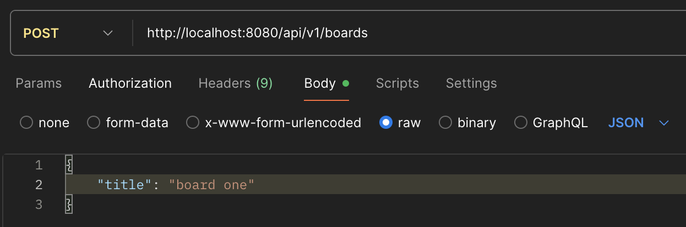
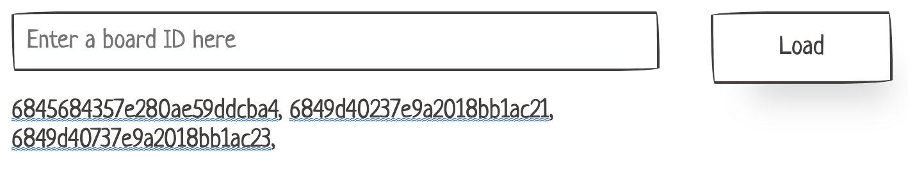

# IncodeKanban

> ℹ️ This project was developed as a solution to the [Test Task](https://github.com/Vladymyrdev/github-kanban-test-task).

## Quick Start

### Prerequirements
1. Start MongoDB using Docker Compose:
   ```bash
   cd rest-api
   docker compose up -d
   ```
1. Set up environment variables:
    - **Backend**: Create a `.env` file in the `rest-api` directory
    - **Frontend**: Create a `.env` file in the `web-client` directory

### Run both applications
```bash
npm run dev
```

### Access the Application

- Frontend: http://localhost:5173
- API: http://localhost:8080

## Documentation

- [API Documentation](./rest-api/README.md)
- [Frontend Documentation](./web-client/README.md)

## Before Beginning

#### 1. Create a board first

The app can only load boards that already exist.
Use Postman (or any REST client) to create one or more boards:


#### 2. Pick a board in the UI

When the frontend starts it fetches all boards and shows them. Click a name to autofill the input and load cards for that board.


#### 3. Drag-and-drop is still TODO

I did not have time to finish card re-ordering and change status.
My plan is:

* **Database-side** – add a statuses field to every board. The position of a cardId inside each array matches the exact top-to-bottom order you see in that column on the kanban board

  ```json
  {
    "_id": "...",
    "title": "My first board",
    "statuses": {
      "todo":        ["cardId1", "cardId5"],
      "in-progress": ["cardId2"],
      "done":        ["cardId3", "cardId4"]
    }
  }
  ```

* **Frontend** – use the classic React-DnD library
  * Sort list items: https://react-dnd.github.io/react-dnd/examples/sortable/simple
  * Move between columns: https://react-dnd.github.io/react-dnd/examples/dustbin/copy-or-move
  * Re-order inside a column
    `PATCH /boards/{boardId}/sort` – body: the full array of card IDs for that column.
  * Move to another column
    `PATCH /cards/{cardId}` – body: the card’s new `status` value
